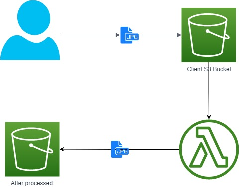

# Event-Driven Image Processing using AWS Lambda and S3

This project provides a solution for event-driven image processing using AWS Lambda and S3. Whenever a new image is uploaded to the source S3 bucket, the Lambda function processes the image by adding a watermark and uploads the processed image to the destination S3 bucket.

## Architecture Diagram

## Prerequisites

- AWS account
- AWS CLI installed and configured
- Terraform installed

## Usage

1. Clone this repository: `git clone https://github.com/<username>/event-driven-image-processing.git`
2. `cd` into the `event-driven-image-processing/lambda` directory.
3. Run `terraform init` to initialize the Terraform configuration.
4. Update the `DESTINATION_BUCKET` and `WATERMARK_TEXT` variables in the `main.tf` file according to your requirements.
5. Run `terragrunt apply` to create the necessary resources on AWS.
6. Upload an image to the source S3 bucket.
7. Check the destination S3 bucket for the processed image.

## Files

The `lambda` directory contains the Lambda function code, Terraform files, and configuration files.

- `lambda/lambda_function`: Directory containing the Lambda function code.
- `lambda/lambda_function/arial.ttf`: Font file used for the watermark.
- `lambda/lambda_function/lambda_function.py`: Lambda function code.
- `lambda/main.tf`: Terraform configuration file to create the necessary AWS resources.
- `lambda/terragrunt.tf`: Wrapper file to use Terragrunt for Terraform configuration management.
- `env.hcl`: Optional file to define environment-specific variables.
- `terragrunt.hcl`: Terragrunt configuration file to configure the backend and provide AWS access and region. The bucket name must be changed according to the environment.

## Commands

The following commands are available to manage the resources:

- `terragrunt plan`: Generate an execution plan for the resources to be created.
- `terragrunt apply`: Apply the changes to create the resources.
- `terragrunt destroy`: Destroy the created resources.

